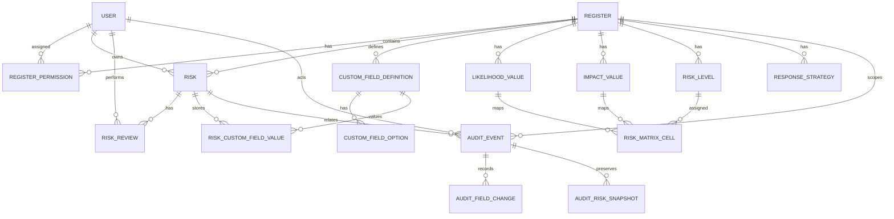

# Custom Risk — Data Model

**Version:** 1.3  
**Date:** 2026-05-09  
**Status:** Active  
**Applies to:** Current implementation  
**Related documents:** Technical Architecture v1.1, Permission Model v1.1, Audit Model v1.1

---

## 1. Purpose

This document describes the logical data model and business logic rules for Custom Risk.

The canonical physical schema is `backend/prisma/schema.prisma`. Do not rely on this document for field lists, column types, or index definitions — read the Prisma schema directly. This document covers:

- the modelling principles behind the schema design;
- a high-level entity relationship overview;
- derived value and calculation rules (business logic not visible in the schema);
- transaction boundaries for multi-table operations.

Access control rules are defined in `permission-model.md`. Audit event structure is defined in `audit-model.md`.

---

## 2. Modelling Principles

1. **Registers are the primary configuration boundary.**  
   Field definitions, scoring values, risk levels, matrix mappings, review settings, permissions, and risk records are all scoped to a register.

2. **Risk records contain stable core fields and flexible custom values.**  
   Core fields are modelled as columns on `risk`. Configurable fields are modelled using field definitions and separate field value rows.

3. **Permissions are additive.**  
   System Admin is stored at user level. Register Admin and Register Viewer are stored as register permission assignments. Risk Owner access is derived from the risk owner field.

4. **Calculated fields are persisted for operational use but remain system-controlled.**  
   Risk score and risk level are calculated from likelihood, impact, and the register matrix. They are not directly editable through normal user workflows.

5. **Audit is append-only and first-class.**  
   Key actions create structured audit events. Audit events, field-change rows, and deletion snapshots must not be edited through the application UI.

6. **Configuration deactivation is preferred over deletion.**  
   Likelihood values, impact values, risk levels, custom fields, dropdown options, and users are generally deactivated rather than deleted where historical records may depend on them.

---

## 3. Core Entity Relationship Overview

The diagram below shows the core risk model. The complete schema — including `PersonReference`, `RefreshToken`, `ApiKey`, `ExportJob`, and auth tables — is in `backend/prisma/schema.prisma`.



---

## 4. Derived Values and Calculation Rules

These rules are enforced in application service logic, not by the database schema.

### 4.1 Risk ID generation

Risk ID format depends on register configuration:

| Prefix set | Zero-padding enabled | Example output |
|---|---|---|
| No | No | `1`, `2`, `3` |
| Yes | No | `RISK-1`, `RISK-42` |
| No | Yes (width 4) | `0001`, `0042` |
| Yes | Yes (width 4) | `RISK-0001`, `RISK-0042` |

```text
sequence_str = str(next_risk_sequence)
if zero_padding_enabled:
    sequence_str = sequence_str.zfill(zero_padding_width)
if prefix is set and not empty:
    display_risk_id = "{prefix}-{sequence_str}"
else:
    display_risk_id = sequence_str
```

- Generate the next sequence number transactionally per register to avoid gaps or duplicates.
- Increment `next_risk_sequence` atomically as part of the risk creation transaction.
- Enforce uniqueness of `display_risk_id` within each register.
- Changing prefix or padding settings does not retroactively alter existing Risk IDs.

### 4.2 Risk score calculation

```text
risk_score = likelihood_value.numeric_value × impact_value.numeric_value
```

- Recalculate when likelihood or impact changes.
- `risk.risk_score` is system-controlled; users cannot edit it directly.
- Store the calculated value on `risk` to support filtering, sorting, and export.

### 4.3 Risk level calculation

```text
risk.risk_level_id = risk_matrix_cell.risk_level_id
where risk_matrix_cell.likelihood_value_id = risk.likelihood_value_id
  and risk_matrix_cell.impact_value_id = risk.impact_value_id
  and risk_matrix_cell.register_id = risk.register_id
```

- Block risk saves if the active likelihood/impact combination has no matrix mapping.
- Recalculate when likelihood, impact, or the relevant matrix cell changes.

### 4.4 Next review date calculation

```text
if review completed:
    next_review_date = reviewed_at date + register.default_review_frequency_months
if never reviewed:
    next_review_date = risk.created_date + register.default_review_frequency_months
```

- If reviews are disabled, `next_review_date` may be null and review status is `NOT_REQUIRED`.
- If `created_date` changes and the risk has never been reviewed, recalculate `next_review_date`.
- Create both `risk_review` and `audit_event` in the same transaction when a review is completed.

### 4.5 Review status derivation

Review status is derived at query time — it is not persisted.

**Display label:**

```text
if register.reviews_enabled is false  → NOT_REQUIRED
else if risk.last_reviewed_at is null → NOT_REVIEWED
else if risk.next_review_date < current_date → OVERDUE
else if risk.next_review_date <= current_date + 30 days → DUE_SOON
else → NOT_DUE
```

**Overdue filter and dashboard count:**

```text
is_overdue =
    register.reviews_enabled = true
    AND risk.next_review_date < current_date
    AND risk.state != 'CLOSED'
```

A never-reviewed risk displays as `NOT_REVIEWED`, but if its `next_review_date` is in the past it must still appear in overdue filter results and dashboard counts. Use `is_overdue` for counts and filters; use the display label derivation for the status column.

---

## 5. Transaction Boundaries

The following operations must be fully transactional.

### 5.1 Create register

- `register`
- initial `register_permission` rows
- default `likelihood_value` rows
- default `impact_value` rows
- default `risk_level` rows
- default `risk_matrix_cell` rows
- default `response_strategy` rows
- `audit_event` rows

### 5.2 Create risk

- allocate register risk sequence
- create `risk`
- create required `risk_custom_field_value` rows
- calculate `risk_score`
- calculate `risk_level_id`
- calculate `next_review_date` where reviews are enabled
- create `audit_event`

### 5.3 Edit risk

- `risk` core fields
- relevant `risk_custom_field_value` rows
- recalculate score/level if likelihood or impact changed
- recalculate next review date if Created Date changed and risk has never been reviewed
- create `audit_field_change` rows under the `audit_event`

### 5.4 Complete review

- create `risk_review`
- update `risk.last_reviewed_at`
- update `risk.last_reviewed_by_user_id`
- update `risk.next_review_date`
- create `audit_event`

### 5.5 Delete risk

- create `RISK_DELETED` row in `audit_event`
- create `audit_risk_snapshot` with the full last-known risk record including deletion reason
- delete `risk_custom_field_value` rows
- hard delete `risk`

The full snapshot must be written before the risk row is removed. If review rows are cascade-deleted, the review history summary must be captured in `audit_risk_snapshot.snapshot_json`.
