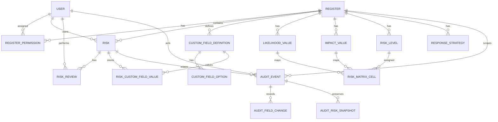

# Custom Risk — MVP Data Model

**Version:** 1.2  
**Date:** 2026-05-04  

---

## 1. Purpose

This document defines a proposed MVP data model for **Custom Risk**, a configurable risk register web application.

The model is intended to support the MVP capabilities described in the supplied documents:

- local users and authentication;
- system-level and register-level permissions;
- configurable risk registers;
- configurable custom risk fields;
- configurable likelihood, impact, risk levels, and matrix mapping;
- risk creation, editing, ownership, review, filtering, and export;
- audit history for key changes.

This is a logical data model. It is deliberately technology-neutral and can be implemented in a relational database, document database, or ORM-backed persistence layer. The structure below assumes a relational implementation because the MVP has strong integrity, permission, configuration, and audit requirements.

---

## 2. Modelling Principles

1. **Registers are the primary configuration boundary.**  
   Field definitions, scoring values, risk levels, matrix mappings, review settings, permissions, and risk records are scoped to a register.

2. **Risk records contain stable core fields and flexible custom values.**  
   Core fields are modelled as columns on `risk`. Configurable fields are modelled using field definitions and separate field value rows.

3. **Permissions are additive.**  
   System Admin is stored at user level. Register Admin and Register Viewer are stored as register permission assignments. Risk Owner access is derived from the risk owner field. In MVP, Risk Owner must be an existing local user.

4. **Calculated fields are persisted for operational use but remain system-controlled.**  
   Risk score and risk level are calculated from likelihood, impact, and the register matrix. They should not be directly editable through normal user workflows.

5. **Audit is append-only and first-class.**  
   Key actions create structured audit events. Audit events, field-change rows, and deletion snapshots should not be edited through the application UI. Audit storage is deliberately modelled as a proper set of tables rather than a single flat text log.

6. **Configuration deactivation is preferred over deletion.**  
   Likelihood values, impact values, risk levels, custom fields, dropdown options, and users should generally be deactivated rather than deleted where historical records may depend on them.

---

## 3. High-Level Entity Relationship Overview



---

## 4. Core Tables

## 4.1 `user`

Stores local user accounts and system-level role state.

| Field | Type | Required | Notes |
|---|---:|:---:|---|
| `id` | UUID | Yes | Internal immutable identifier. |
| `name` | String | Yes | Display name. |
| `email` | String | Yes | Unique user identifier. Case-insensitive unique constraint recommended. |
| `password_hash` | String | Yes | Local authentication credential. Do not store plain passwords. |
| `is_system_admin` | Boolean | Yes | Grants system-wide administrative rights. Default `false`. |
| `is_active` | Boolean | Yes | Inactive users cannot log in. Default `true`. |
| `created_at` | Timestamp | Yes | System timestamp. |
| `created_by_user_id` | UUID FK -> `user.id` | No | Null for bootstrap/system-created users. |
| `updated_at` | Timestamp | Yes | System timestamp. |
| `updated_by_user_id` | UUID FK -> `user.id` | No | Last updater. |

### Constraints and indexes

- Unique: `email`.
- Index: `is_active`.
- Index: `is_system_admin`.

### Notes

- Users are deactivated rather than deleted in MVP.
- Risk ownership should continue to resolve to the deactivated user record after deactivation. MVP does not allow assigning a risk to an unresolved email-only owner.
- If seed/demo data is used, at least one active System Admin must exist.

---

## 4.2 `register`

Stores one configurable risk register.

| Field | Type | Required | Notes |
|---|---:|:---:|---|
| `id` | UUID | Yes | Internal immutable identifier. |
| `name` | String | Yes | Unique register name. |
| `description` | Text | No | Register description. |
| `risk_id_prefix` | String | No | Optional prefix for generated displayed Risk IDs. When null or empty, Risk ID is a plain number (e.g. `1`, `2`, `3`). When set, format is `{prefix}-{number}` (e.g. `RISK-1`). |
| `risk_id_zero_padding_enabled` | Boolean | Yes | Whether to zero-pad the numeric portion of the Risk ID. Default `false`. |
| `risk_id_zero_padding_width` | Integer | Conditional | Number of digits to pad to when zero-padding is enabled. Required when `risk_id_zero_padding_enabled = true`. Default `4`. Example: width 4 produces `0001`, `0042`. |
| `next_risk_sequence` | Integer | Yes | Next sequence number for generated Risk IDs. Default `1`. |
| `default_new_risk_state` | Enum | Yes | State applied to newly created risks. Default `DRAFT`. MVP value is always `DRAFT`; retained as a column for future configurability. |
| `reviews_enabled` | Boolean | Yes | Default `true`. |
| `default_review_frequency_months` | Integer | Conditional | Required when reviews are enabled. Default `12`. MVP uses a single frequency for all risks in the register; field-based frequency rules are deferred. |
| `review_attestation_text` | Text | Conditional | Required when reviews are enabled. |
| `allow_viewer_export` | Boolean | Yes | Default `false`. |
| `created_at` | Timestamp | Yes | System timestamp. |
| `created_by_user_id` | UUID FK -> `user.id` | Yes | Creator. |
| `updated_at` | Timestamp | Yes | System timestamp. |
| `updated_by_user_id` | UUID FK -> `user.id` | Yes | Last updater. |

### Constraints and indexes

- Unique: `name`.
- Unique or guarded sequence: `(id, next_risk_sequence)` through transactional generation.
- Check: `default_review_frequency_months > 0` when `reviews_enabled = true`.
- Check: `risk_id_zero_padding_width >= 2` when `risk_id_zero_padding_enabled = true`.
- Index: `name`.

### Notes

- New registers should be seeded with default states, response strategies, likelihood values, impact values, risk levels, and matrix cells.
- The MVP has fixed states, so risk states can be an enum rather than a configurable table unless future-proofing is preferred.
- `default_new_risk_state` is `DRAFT` for all MVP registers. It is modelled as a column rather than a hard-coded default to avoid a schema change when this becomes configurable in a later release.
- Risk ID generation logic: if `risk_id_zero_padding_enabled` is false, format is `{prefix}-{sequence}` or plain `{sequence}`. If true, the sequence is left-padded with zeros to `risk_id_zero_padding_width` digits before formatting.

---

## 4.3 `register_permission`

Stores register-level user assignments.

| Field | Type | Required | Notes |
|---|---:|:---:|---|
| `id` | UUID | Yes | Internal identifier. |
| `register_id` | UUID FK -> `register.id` | Yes | Register scope. |
| `user_id` | UUID FK -> `user.id` | Yes | Assigned user. |
| `role` | Enum | Yes | `REGISTER_ADMIN` or `REGISTER_VIEWER`. |
| `created_at` | Timestamp | Yes | Assignment timestamp. |
| `created_by_user_id` | UUID FK -> `user.id` | Yes | Actor. |

### Constraints and indexes

- Unique: `(register_id, user_id, role)`.
- Index: `(user_id, role)`.
- Index: `(register_id, role)`.

### Notes

- System Admin is not stored here. It is stored on `user.is_system_admin`.
- Last Register Admin protection is an application/service rule: prevent removal of the final `REGISTER_ADMIN` unless performed by a System Admin.

---

## 5. Risk Tables

## 5.1 `risk`

Stores the core risk record.

| Field | Type | Required | Notes |
|---|---:|:---:|---|
| `id` | UUID | Yes | Internal immutable risk ID. |
| `register_id` | UUID FK -> `register.id` | Yes | Owning register. |
| `display_risk_id` | String | Yes | User-facing Risk ID, generated from register prefix and sequence. |
| `risk_sequence` | Integer | Yes | Numeric sequence within register. |
| `title` | String | Yes | Risk Title. |
| `description` | Text | Yes | Risk Description. |
| `state` | Enum | Yes | `DRAFT`, `OPEN`, `CLOSED`. |
| `owner_user_id` | UUID FK -> `user.id` | Yes | MVP Risk Owner. |
| `created_date` | Date | Yes | Business/original created date. |
| `likelihood_value_id` | UUID FK -> `likelihood_value.id` | Yes | Selected likelihood. |
| `impact_value_id` | UUID FK -> `impact_value.id` | Yes | Selected impact. |
| `risk_score` | Decimal/Integer | Yes | Calculated as likelihood numeric value × impact numeric value. |
| `risk_level_id` | UUID FK -> `risk_level.id` | Yes | Calculated from matrix. |
| `response_strategy_id` | UUID FK -> `response_strategy.id` | Yes | Selected response strategy. |
| `response_action` | Text | No | Simple Risk Response Action field for MVP. |
| `last_reviewed_at` | Timestamp | No | Set through review action only. |
| `last_reviewed_by_user_id` | UUID FK -> `user.id` | No | Latest reviewer. |
| `next_review_date` | Date | Conditional | Calculated when reviews are enabled. |
| `system_created_at` | Timestamp | Yes | Immutable system creation timestamp. |
| `system_created_by_user_id` | UUID FK -> `user.id` | Yes | Creator. |
| `system_updated_at` | Timestamp | Yes | Last system update timestamp. |
| `system_updated_by_user_id` | UUID FK -> `user.id` | Yes | Last updater. |

### Constraints and indexes

- Unique: `(register_id, display_risk_id)`.
- Unique: `(register_id, risk_sequence)`.
- Index: `(register_id, state)`.
- Index: `(register_id, owner_user_id)`.
- Index: `(register_id, risk_level_id)`.
- Index: `(register_id, next_review_date)`.
- Index: `system_updated_at`.

### Notes

- `risk_score`, `risk_level_id`, `last_reviewed_at`, `last_reviewed_by_user_id`, and `next_review_date` are system-controlled fields.
- Closed risks remain in the table but are excluded from operational views by default.
- Hard delete is allowed only for System Admin correction/error handling. The final audit entry should capture a last-known snapshot where practical.

---

## 5.2 `risk_review`

Stores immutable review history entries.

| Field | Type | Required | Notes |
|---|---:|:---:|---|
| `id` | UUID | Yes | Internal identifier. |
| `risk_id` | UUID FK -> `risk.id` | Yes | Reviewed risk. |
| `register_id` | UUID FK -> `register.id` | Yes | Denormalised for filtering and audit. |
| `reviewed_by_user_id` | UUID FK -> `user.id` | Yes | Reviewer. |
| `reviewed_at` | Timestamp | Yes | Review timestamp. |
| `comment` | Text | No | Optional in MVP. |
| `attestation_text` | Text | Yes | Text shown at time of review. |
| `calculated_next_review_date` | Date | Yes | Next review date calculated by the review action. |
| `created_at` | Timestamp | Yes | System timestamp. |

### Constraints and indexes

- Index: `(risk_id, reviewed_at)`.
- Index: `(register_id, reviewed_at)`.
- Index: `reviewed_by_user_id`.

### Notes

- Review history is read-only through the UI.
- Updating a risk review should not be supported in MVP.
- Risk `last_reviewed_at`, `last_reviewed_by_user_id`, and `next_review_date` should be updated from the latest review transaction.

---

## 6. Register Configuration Tables

## 6.1 `likelihood_value`

Stores configurable likelihood values per register.

| Field | Type | Required | Notes |
|---|---:|:---:|---|
| `id` | UUID | Yes | Internal identifier. |
| `register_id` | UUID FK -> `register.id` | Yes | Register scope. |
| `name` | String | Yes | Display name, e.g. `Rare`. |
| `numeric_value` | Decimal/Integer | Yes | Used for score calculation. |
| `display_order` | Integer | Yes | Ordering in UI and matrix. |
| `is_active` | Boolean | Yes | Inactive values cannot be selected for new updates. |
| `created_at` | Timestamp | Yes | System timestamp. |
| `updated_at` | Timestamp | Yes | System timestamp. |

### Constraints and indexes

- Unique: `(register_id, name)`.
- Unique recommended: `(register_id, numeric_value)` unless duplicate numeric values are intentionally allowed.
- Unique recommended: `(register_id, display_order)`.
- Index: `(register_id, is_active)`.

---

## 6.2 `impact_value`

Stores configurable impact values per register.

| Field | Type | Required | Notes |
|---|---:|:---:|---|
| `id` | UUID | Yes | Internal identifier. |
| `register_id` | UUID FK -> `register.id` | Yes | Register scope. |
| `name` | String | Yes | Display name, e.g. `Major`. |
| `numeric_value` | Decimal/Integer | Yes | Used for score calculation. |
| `display_order` | Integer | Yes | Ordering in UI and matrix. |
| `is_active` | Boolean | Yes | Inactive values cannot be selected for new updates. |
| `created_at` | Timestamp | Yes | System timestamp. |
| `updated_at` | Timestamp | Yes | System timestamp. |

### Constraints and indexes

- Unique: `(register_id, name)`.
- Unique recommended: `(register_id, numeric_value)` unless duplicate numeric values are intentionally allowed.
- Unique recommended: `(register_id, display_order)`.
- Index: `(register_id, is_active)`.

---

## 6.3 `risk_level`

Stores qualitative risk levels per register.

| Field | Type | Required | Notes |
|---|---:|:---:|---|
| `id` | UUID | Yes | Internal identifier. |
| `register_id` | UUID FK -> `register.id` | Yes | Register scope. |
| `name` | String | Yes | Example: `Low`, `Medium`, `High`, `Critical`. |
| `description` | Text | No | Optional explanatory text. |
| `display_order` | Integer | Yes | Ordering in UI. |
| `is_active` | Boolean | Yes | At least one active risk level required. |
| `created_at` | Timestamp | Yes | System timestamp. |
| `updated_at` | Timestamp | Yes | System timestamp. |

### Constraints and indexes

- Unique: `(register_id, name)`.
- Unique recommended: `(register_id, display_order)`.
- Index: `(register_id, is_active)`.

---

## 6.4 `risk_matrix_cell`

Maps likelihood and impact combinations to risk levels.

| Field | Type | Required | Notes |
|---|---:|:---:|---|
| `id` | UUID | Yes | Internal identifier. |
| `register_id` | UUID FK -> `register.id` | Yes | Register scope. |
| `likelihood_value_id` | UUID FK -> `likelihood_value.id` | Yes | Matrix row/axis value. |
| `impact_value_id` | UUID FK -> `impact_value.id` | Yes | Matrix column/axis value. |
| `risk_level_id` | UUID FK -> `risk_level.id` | Yes | Assigned risk level. |
| `created_at` | Timestamp | Yes | System timestamp. |
| `updated_at` | Timestamp | Yes | System timestamp. |

### Constraints and indexes

- Unique: `(register_id, likelihood_value_id, impact_value_id)`.
- Index: `(register_id, risk_level_id)`.

### Notes

- Every active likelihood/impact combination must have a matrix cell before risks using those scoring values can be saved.
- Risk level recalculation should read from this table after likelihood or impact changes.

---

## 6.5 `response_strategy`

Stores response strategy values per register.

| Field | Type | Required | Notes |
|---|---:|:---:|---|
| `id` | UUID | Yes | Internal identifier. |
| `register_id` | UUID FK -> `register.id` | Yes | Register scope. |
| `name` | String | Yes | Defaults: `Accept`, `Mitigate`, `Transfer`, `Avoid`. |
| `display_order` | Integer | Yes | UI ordering. |
| `is_active` | Boolean | Yes | Inactive values cannot be selected for new updates. |
| `created_at` | Timestamp | Yes | System timestamp. |
| `updated_at` | Timestamp | Yes | System timestamp. |

### Constraints and indexes

- Unique: `(register_id, name)`.
- Unique recommended: `(register_id, display_order)`.
- Index: `(register_id, is_active)`.

### Notes

- The MVP Functional Specification confirms default response strategies on register creation. The MVP does not require a dedicated configuration screen for response strategy unless implementation chooses to provide one.

---

## 7. Custom Field Tables

## 7.1 `custom_field_definition`

Defines custom risk fields for a register.

| Field | Type | Required | Notes |
|---|---:|:---:|---|
| `id` | UUID | Yes | Internal identifier. |
| `register_id` | UUID FK -> `register.id` | Yes | Register scope. |
| `field_name` | String | Yes | Unique within register. |
| `field_type` | Enum | Yes | `TEXT`, `MULTILINE_TEXT`, `BOOLEAN`, `NUMBER`, `DATE`, `DROPDOWN`, `PERSON_PICKER`. |
| `help_text` | Text | No | UI help text. |
| `is_required` | Boolean | Yes | Required/block-save validation. Default `false`. |
| `display_order` | Integer | Yes | Ordering on forms. |
| `is_active` | Boolean | Yes | Inactive fields hidden from new risk forms by default. |
| `created_at` | Timestamp | Yes | System timestamp. |
| `created_by_user_id` | UUID FK -> `user.id` | Yes | Creator. |
| `updated_at` | Timestamp | Yes | System timestamp. |
| `updated_by_user_id` | UUID FK -> `user.id` | Yes | Last updater. |

### Constraints and indexes

- Unique: `(register_id, field_name)`.
- Unique recommended: `(register_id, display_order)`.
- Index: `(register_id, is_active)`.
- Check: `field_type` cannot be changed after creation in MVP.

### Notes

- Field deactivation should retain existing values.
- Calculated fields and field-level visibility are out of scope for MVP.

---

## 7.2 `custom_field_option`

Stores dropdown options for custom fields of type `DROPDOWN`.

| Field | Type | Required | Notes |
|---|---:|:---:|---|
| `id` | UUID | Yes | Internal identifier. |
| `custom_field_definition_id` | UUID FK -> `custom_field_definition.id` | Yes | Parent field. |
| `label` | String | Yes | Displayed option label. |
| `display_order` | Integer | Yes | Ordering in dropdown. |
| `is_active` | Boolean | Yes | Inactive options retained for historical values. |
| `created_at` | Timestamp | Yes | System timestamp. |
| `updated_at` | Timestamp | Yes | System timestamp. |

### Constraints and indexes

- Unique: `(custom_field_definition_id, label)`.
- Unique recommended: `(custom_field_definition_id, display_order)`.
- Index: `(custom_field_definition_id, is_active)`.

### Notes

- Active dropdown fields require at least one active option.
- Existing risks may retain deactivated option values.

---

## 7.3 `risk_custom_field_value`

Stores custom field values for risks.

| Field | Type | Required | Notes |
|---|---:|:---:|---|
| `id` | UUID | Yes | Internal identifier. |
| `risk_id` | UUID FK -> `risk.id` | Yes | Parent risk. |
| `register_id` | UUID FK -> `register.id` | Yes | Denormalised for query filtering and validation. |
| `custom_field_definition_id` | UUID FK -> `custom_field_definition.id` | Yes | Field definition. |
| `text_value` | Text | No | For text and multi-line text. |
| `number_value` | Decimal | No | For number fields. |
| `boolean_value` | Boolean | No | For boolean fields. |
| `date_value` | Date | No | For date fields. |
| `person_user_id` | UUID FK -> `user.id` | No | For person picker when linked to a local user. |
| `person_email` | String | No | For person picker value, including unresolved emails if allowed later. |
| `dropdown_option_id` | UUID FK -> `custom_field_option.id` | No | For dropdown fields. |
| `created_at` | Timestamp | Yes | System timestamp. |
| `updated_at` | Timestamp | Yes | System timestamp. |

### Constraints and indexes

- Unique: `(risk_id, custom_field_definition_id)`.
- Index: `(register_id, custom_field_definition_id)`.
- Index: `dropdown_option_id`.
- Index: `person_user_id`.
- Optional validation: exactly one value column should be populated according to `field_type`.

### Notes

- This entity-value model supports field configuration without schema changes.
- Required field validation is enforced by application/service logic based on active field definitions.
- For MVP Risk Owner, use `risk.owner_user_id` rather than storing the owner as a custom field. Email-only owner assignment and later automatic linking remain post-MVP PRD capabilities.
- **Person Picker MVP behaviour:** For Person Picker custom fields, `person_user_id` must reference an existing active local user. The `person_email` column is included in the schema to support future email-only unresolved assignment without a schema change, but it should not be populated by MVP application logic. Validation must ensure a valid `person_user_id` is provided for any required or completed Person Picker field. If a referenced user is later deactivated, the stored `person_user_id` is retained and continues to reference the inactive user record.

---

## 8. Audit Tables

Audit logging is a core MVP capability and is modelled explicitly. The goal is to support reliable system, register, and risk audit views without forcing all evidence into a single overloaded text field.

The MVP audit model uses:

1. `audit_event` for the main append-only event record;
2. `audit_field_change` for structured before/after field changes;
3. `audit_risk_snapshot` for full last-known snapshots of hard-deleted risks.

Risk Response audit tables are deferred until child-record Risk Response Actions are introduced.

## 8.1 `audit_event`

Stores the primary append-only audit event.

| Field | Type | Required | Notes |
|---|---:|:---:|---|
| `id` | UUID | Yes | Internal identifier. |
| `occurred_at` | Timestamp | Yes | Event timestamp, stored in UTC. |
| `actor_user_id` | UUID FK -> `user.id` | No | Null for system events or unknown actors. |
| `actor_display_name` | String | No | Denormalised actor name at time of event. |
| `actor_email` | String | No | Denormalised actor email at time of event. |
| `action` | String/Enum | Yes | Example: `RISK_CREATED`, `FIELD_CHANGED`, `RISK_REVIEWED`. |
| `object_type` | String/Enum | Yes | Example: `USER`, `REGISTER`, `RISK`, `CUSTOM_FIELD`, `MATRIX`. |
| `object_id` | UUID/String | Yes | Identifier of affected object. |
| `object_display_name` | String | No | Human-readable object name where useful, such as Risk ID or register name. |
| `scope_type` | Enum | Yes | `SYSTEM`, `REGISTER`, or `RISK`. |
| `register_id` | UUID FK -> `register.id` | No | Present for register-scoped and risk-scoped events. |
| `risk_id` | UUID FK -> `risk.id` | No | Present for risk-scoped events while the risk exists. |
| `display_risk_id` | String | No | Denormalised Risk ID for lookup after hard delete. |
| `summary` | Text | Yes | Human-readable event summary. |
| `metadata_json` | JSON | No | Additional structured details, for example export filters or security context. |
| `created_at` | Timestamp | Yes | System timestamp. |

### Constraints and indexes

- Index: `occurred_at`.
- Index: `actor_user_id`.
- Index: `(scope_type, occurred_at)`.
- Index: `(register_id, occurred_at)`.
- Index: `(risk_id, occurred_at)`.
- Index: `(display_risk_id, occurred_at)`.
- Index: `(object_type, object_id)`.
- Index: `action`.

### Notes

- Audit events should not be updated or deleted through the application.
- System, register, and risk audit logs can be implemented as filtered views over this table plus related detail tables.
- Denormalised actor and object fields help preserve context if users or risks are later deactivated or hard-deleted.

---

## 8.2 `audit_field_change`

Stores structured field-level changes for audit events that change one or more fields.

| Field | Type | Required | Notes |
|---|---:|:---:|---|
| `id` | UUID | Yes | Internal identifier. |
| `audit_event_id` | UUID FK -> `audit_event.id` | Yes | Parent audit event. |
| `field_name` | String | Yes | Stable field name or configuration key. |
| `field_label` | String | No | Display label at time of change. |
| `previous_value` | Text/JSON | No | Previous value where relevant. |
| `new_value` | Text/JSON | No | New value where relevant. |
| `value_type` | String/Enum | No | Optional helper: `TEXT`, `NUMBER`, `BOOLEAN`, `DATE`, `JSON`, `USER`, etc. |
| `created_at` | Timestamp | Yes | System timestamp. |

### Constraints and indexes

- Index: `audit_event_id`.
- Index: `field_name`.

### Notes

- Multiple field-change rows can belong to one audit event.
- This avoids losing structured before/after evidence in a single summary string.

---

## 8.3 `audit_risk_snapshot`

Stores the full last-known risk snapshot for hard-deleted risks.

| Field | Type | Required | Notes |
|---|---:|:---:|---|
| `id` | UUID | Yes | Internal identifier. |
| `audit_event_id` | UUID FK -> `audit_event.id` | Yes | Parent `RISK_DELETED` audit event. |
| `risk_internal_id` | UUID | Yes | Deleted risk internal ID. Stored as value rather than FK to support hard delete. |
| `register_id` | UUID FK -> `register.id` | Yes | Register containing the deleted risk. |
| `display_risk_id` | String | Yes | User-facing Risk ID. |
| `snapshot_json` | JSON | Yes | Full last-known risk snapshot. |
| `deletion_reason` | Text | No | Optional reason supplied by the deleting System Admin. |
| `created_at` | Timestamp | Yes | System timestamp. |

### Snapshot contents

`snapshot_json` should include, at minimum:

- all core risk fields;
- calculated score and level values;
- owner ID, owner display name, and owner email;
- likelihood, impact, response strategy, and state labels at time of deletion;
- all active and inactive custom field values for the risk;
- last reviewed details and review history summary;
- system created/updated metadata;
- deletion actor, deletion timestamp, and deletion reason where provided.

### Constraints and indexes

- Unique: `audit_event_id`.
- Index: `(register_id, display_risk_id)`.
- Index: `risk_internal_id`.

### Notes

- This table is required for MVP because hard delete is allowed for System Admin correction/error handling.
- The snapshot should be written in the same transaction as the delete audit event and before the risk row is removed.
---

## 9. Optional Export Logging Table

## 9.1 `export_job`

This table is optional for MVP. The audit event log is sufficient to record that an export occurred. Use this table only if the implementation needs export job metadata, troubleshooting, or repeatable export history.

| Field | Type | Required | Notes |
|---|---:|:---:|---|
| `id` | UUID | Yes | Internal identifier. |
| `register_id` | UUID FK -> `register.id` | Yes | Exported register. |
| `requested_by_user_id` | UUID FK -> `user.id` | Yes | Requesting user. |
| `requested_at` | Timestamp | Yes | Request timestamp. |
| `filter_json` | JSON | No | Filters applied to export. |
| `included_closed_risks` | Boolean | Yes | Whether closed risks were included. |
| `row_count` | Integer | No | Number of rows exported, if known. |
| `status` | Enum | Yes | `REQUESTED`, `COMPLETED`, `FAILED`. |
| `completed_at` | Timestamp | No | Completion timestamp. |

---

## 10. Enumerations

## 10.1 User and permission enums

### `register_permission.role`

- `REGISTER_ADMIN`
- `REGISTER_VIEWER`

### Effective roles, derived at runtime

- `SYSTEM_ADMIN`
- `REGISTER_ADMIN`
- `REGISTER_VIEWER`
- `RISK_OWNER`

These should generally be calculated rather than stored as a single effective role because permissions are additive.

---

## 10.2 Risk enums

### `risk.state`

- `DRAFT`
- `OPEN`
- `CLOSED`

### Review status, derived at runtime

- `NOT_REQUIRED`
- `NOT_REVIEWED`
- `NOT_DUE`
- `DUE_SOON`
- `OVERDUE`

Review status does not need to be persisted. It can be derived from register review settings, `risk.last_reviewed_at`, `risk.next_review_date`, and the current date.

---

## 10.3 Custom field enums

### `custom_field_definition.field_type`

- `TEXT`
- `MULTILINE_TEXT`
- `BOOLEAN`
- `NUMBER`
- `DATE`
- `DROPDOWN`
- `PERSON_PICKER`

---

## 10.4 Audit action examples

Recommended audit action values:

- `LOGIN_SUCCEEDED`
- `LOGIN_FAILED`
- `LOGOUT`
- `USER_CREATED`
- `USER_UPDATED`
- `USER_ACTIVATED`
- `USER_DEACTIVATED`
- `SYSTEM_ADMIN_GRANTED`
- `SYSTEM_ADMIN_REMOVED`
- `REGISTER_CREATED`
- `REGISTER_SETTINGS_UPDATED`
- `REGISTER_ADMIN_ADDED`
- `REGISTER_ADMIN_REMOVED`
- `REGISTER_VIEWER_ADDED`
- `REGISTER_VIEWER_REMOVED`
- `CUSTOM_FIELD_CREATED`
- `CUSTOM_FIELD_UPDATED`
- `CUSTOM_FIELD_ACTIVATED`
- `CUSTOM_FIELD_DEACTIVATED`
- `CUSTOM_FIELD_OPTION_CREATED`
- `CUSTOM_FIELD_OPTION_UPDATED`
- `CUSTOM_FIELD_OPTION_DEACTIVATED`
- `LIKELIHOOD_VALUE_CREATED`
- `LIKELIHOOD_VALUE_UPDATED`
- `LIKELIHOOD_VALUE_DEACTIVATED`
- `IMPACT_VALUE_CREATED`
- `IMPACT_VALUE_UPDATED`
- `IMPACT_VALUE_DEACTIVATED`
- `RISK_LEVEL_CREATED`
- `RISK_LEVEL_UPDATED`
- `RISK_LEVEL_DEACTIVATED`
- `RISK_MATRIX_UPDATED`
- `RISK_CREATED`
- `RISK_UPDATED`
- `RISK_FIELD_CHANGED`
- `RISK_OWNER_CHANGED`
- `RISK_STATE_CHANGED`
- `RISK_SCORE_RECALCULATED`
- `RISK_REVIEWED`
- `NEXT_REVIEW_DATE_UPDATED`
- `RISK_DELETED`
- `RISK_EXPORT_GENERATED`
- `PERMISSION_DENIED`

---

## 11. Derived Values and Calculation Rules

## 11.1 Risk ID generation

MVP Risk ID format depends on register configuration:

| Prefix set | Zero-padding enabled | Example output |
|---|---|---|
| No | No | `1`, `2`, `3` |
| Yes | No | `RISK-1`, `RISK-42` |
| No | Yes (width 4) | `0001`, `0042` |
| Yes | Yes (width 4) | `RISK-0001`, `RISK-0042` |

Pseudo-code:

```text
sequence_str = str(next_risk_sequence)
if zero_padding_enabled:
    sequence_str = sequence_str.zfill(zero_padding_width)
if prefix is set and not empty:
    display_risk_id = "{prefix}-{sequence_str}"
else:
    display_risk_id = sequence_str
```

Implementation notes:

- Generate the next sequence number transactionally per register to avoid gaps or duplicates in concurrent environments. Use a database-level lock, serialised transaction, or equivalent mechanism on `register.next_risk_sequence`.
- Increment `next_risk_sequence` atomically as part of the risk creation transaction.
- Store the immutable internal UUID separately from the displayed Risk ID.
- Enforce uniqueness of `display_risk_id` within each register.
- Changing the prefix or padding settings on a register does not retroactively alter existing Risk IDs. Only new risks use the updated format.

---

## 11.2 Risk score calculation

MVP fixed formula:

```text
risk_score = likelihood_value.numeric_value × impact_value.numeric_value
```

Implementation notes:

- Recalculate when likelihood or impact changes.
- Do not allow direct user editing of `risk.risk_score`.
- Store the calculated value on `risk` to simplify table filtering, sorting, dashboards, and export.

---

## 11.3 Risk level calculation

Risk level is determined by the matrix cell for the selected likelihood and impact:

```text
risk.risk_level_id = risk_matrix_cell.risk_level_id
where risk_matrix_cell.likelihood_value_id = risk.likelihood_value_id
and risk_matrix_cell.impact_value_id = risk.impact_value_id
and risk_matrix_cell.register_id = risk.register_id
```

Implementation notes:

- Block risk saves if the active likelihood/impact combination has no matrix mapping.
- Recalculate when likelihood, impact, or relevant matrix cell changes.
- For matrix changes, implementation should decide whether to recalculate affected risks immediately or on next risk update. Immediate recalculation is preferable for dashboard accuracy.

---

## 11.4 Next review date calculation

For MVP:

```text
If review completed:
    next_review_date = reviewed_at date + register.default_review_frequency_months
If never reviewed:
    next_review_date = risk.created_date + register.default_review_frequency_months
```

Implementation notes:

- If reviews are disabled, `next_review_date` may be null and review status is `NOT_REQUIRED`.
- If `created_date` changes and the risk has never been reviewed, recalculate `next_review_date`.
- When a review is completed, create both `risk_review` and `audit_event` rows in the same transaction.

---

## 11.5 Review status calculation

Recommended derived logic:

```text
If register.reviews_enabled is false:
    NOT_REQUIRED
Else if risk.last_reviewed_at is null:
    NOT_REVIEWED
Else if risk.next_review_date < current_date:
    OVERDUE
Else if risk.next_review_date <= current_date + 30 days:
    DUE_SOON
Else:
    NOT_DUE
```

### Display label vs overdue filter behaviour

The derived status above determines the **display label** shown in the risk table and risk detail view.

A never-reviewed risk (`last_reviewed_at` is null) always displays as `NOT_REVIEWED` regardless of `next_review_date`. However, when computing overdue filters and overdue dashboard counts, the system must check `next_review_date < current_date` independently of the display label. A never-reviewed risk whose `next_review_date` is in the past must be included in overdue counts and the overdue filter.

Implementation approach:

```text
is_overdue =
    register.reviews_enabled = true
    AND risk.next_review_date < current_date
    AND risk.state != 'CLOSED'
```

Use `is_overdue` for filter logic and dashboard counts. Use the display label derivation above for the status column. Both can coexist because they serve different purposes.

Review status does not need to be persisted. It is derived at query time from register review settings, `risk.last_reviewed_at`, `risk.next_review_date`, and the current date.

---

## 12. Access Control Data Rules

## 12.1 Register access

A user can access a register if any of the following is true:

- `user.is_system_admin = true`;
- the user has `REGISTER_ADMIN` for the register;
- the user has `REGISTER_VIEWER` for the register;
- the user owns at least one risk in the register.

## 12.2 Risk view access

A user can view a risk if any of the following is true:

- `user.is_system_admin = true`;
- the user has `REGISTER_ADMIN` for the risk's register;
- the user has `REGISTER_VIEWER` for the risk's register;
- `risk.owner_user_id = user.id`.

## 12.3 Risk edit access

A user can edit a risk if any of the following is true:

- `user.is_system_admin = true`;
- the user has `REGISTER_ADMIN` for the risk's register;
- `risk.owner_user_id = user.id`.

Risk Owners cannot directly edit calculated fields, review history, system metadata, risk score, or risk level.

## 12.4 Configuration access

A user can configure a register if either of the following is true:

- `user.is_system_admin = true`;
- the user has `REGISTER_ADMIN` for the register.

## 12.5 Export access

A user can export register risk data if any of the following is true:

- `user.is_system_admin = true`;
- the user has `REGISTER_ADMIN` for the register;
- the user has `REGISTER_VIEWER` for the register and `register.allow_viewer_export = true`.

Risk Owners do not receive export permission from ownership alone in MVP.

---

## 13. Default Seed Data for New Registers

When a register is created, seed the following configuration in one transaction.

## 13.1 Default response strategies

| Name | Display order | Active |
|---|---:|:---:|
| Accept | 1 | Yes |
| Mitigate | 2 | Yes |
| Transfer | 3 | Yes |
| Avoid | 4 | Yes |

## 13.2 Default likelihood values

| Name | Numeric value | Display order | Active |
|---|---:|---:|:---:|
| Rare | 1 | 1 | Yes |
| Unlikely | 2 | 2 | Yes |
| Possible | 3 | 3 | Yes |
| Likely | 4 | 4 | Yes |
| Almost Certain | 5 | 5 | Yes |

## 13.3 Default impact values

| Name | Numeric value | Display order | Active |
|---|---:|---:|:---:|
| Insignificant | 1 | 1 | Yes |
| Minor | 2 | 2 | Yes |
| Moderate | 3 | 3 | Yes |
| Major | 4 | 4 | Yes |
| Severe | 5 | 5 | Yes |

## 13.4 Default risk levels

| Name | Display order | Active |
|---|---:|:---:|
| Low | 1 | Yes |
| Medium | 2 | Yes |
| High | 3 | Yes |
| Critical | 4 | Yes |

## 13.5 Suggested default 5×5 matrix

This matrix is a suggested starting point. It can be adjusted during implementation or register setup.

| Impact \ Likelihood | Rare 1 | Unlikely 2 | Possible 3 | Likely 4 | Almost Certain 5 |
|---|---|---|---|---|---|
| Insignificant 1 | Low | Low | Low | Medium | Medium |
| Minor 2 | Low | Low | Medium | Medium | High |
| Moderate 3 | Low | Medium | Medium | High | High |
| Major 4 | Medium | Medium | High | High | Critical |
| Severe 5 | Medium | High | High | Critical | Critical |

---

## 14. Recommended MVP Queries and Views

These are not necessarily physical database views, but they are useful query shapes.

## 14.1 Accessible registers for user

Returns registers visible to a user via system admin, register permission, or risk ownership.

Key joins:

- `register`
- `register_permission`
- `risk`

## 14.2 Register risk table

Returns risks in a register with:

- core risk fields;
- owner name/email;
- likelihood name;
- impact name;
- risk level name;
- derived review status;
- selected active custom field values.

Default filter:

```text
risk.state in ('DRAFT', 'OPEN')
```

## 14.3 My work dashboard

For Risk Owners:

- open risks where `risk.owner_user_id = current_user.id`;
- due soon risks using derived review status;
- overdue risks using derived review status.

For Register Admins:

- open risk count by administered register;
- overdue review count by administered register;
- risk count by risk level;
- unassigned risk count, if future model allows nullable owners. In MVP, owner is mandatory, so this should normally be zero unless data quality exceptions are allowed.

For System Admins:

- total registers;
- total users;
- open risks across all registers;
- overdue reviews across all registers;
- recent audit activity.

## 14.4 Audit log views

System audit log:

- all `audit_event` records, filtered by System Admin access.

Register audit log:

- `audit_event` records where `register_id = selected_register_id`.

Risk audit summary:

- `audit_event` records where `risk_id = selected_risk_id`, plus review history from `risk_review`.

---

## 15. Transaction Boundaries

The following operations should be transactional.

## 15.1 Create register

Create:

- `register`;
- initial `register_permission` rows;
- default `likelihood_value` rows;
- default `impact_value` rows;
- default `risk_level` rows;
- default `risk_matrix_cell` rows;
- default `response_strategy` rows;
- `audit_event` rows.

## 15.2 Create risk

Create/update:

- allocate register risk sequence;
- create `risk`;
- create required `risk_custom_field_value` rows;
- calculate `risk_score`;
- calculate `risk_level_id`;
- calculate `next_review_date` where reviews are enabled;
- create `audit_event`.

## 15.3 Edit risk

Update:

- `risk` core fields;
- relevant `risk_custom_field_value` rows;
- recalculated score/level if likelihood or impact changed;
- recalculated next review date if Created Date changed and risk has never been reviewed;
- create field-level `audit_event` rows.

## 15.4 Complete review

Create/update:

- create `risk_review`;
- update `risk.last_reviewed_at`;
- update `risk.last_reviewed_by_user_id`;
- update `risk.next_review_date`;
- create `audit_event` rows.

## 15.5 Delete risk

Create/delete in a single transaction:

- create a `RISK_DELETED` row in `audit_event`;
- create related `audit_risk_snapshot` containing the full last-known risk record;
- include deletion reason where provided;
- delete `risk_custom_field_value` rows;
- delete or retain `risk_review` according to implementation decision;
- hard delete `risk`.

The full snapshot must be written before the risk row is removed. If review rows are cascade-deleted, the review history summary must be captured in `audit_risk_snapshot.snapshot_json`.

---

## 16. Out-of-Scope Data Model Areas for MVP

The following PRD concepts should not be modelled as full MVP tables unless deliberately brought forward:

- SAML or external identity provider tables;
- MFA;
- password reset email flows;
- SMTP configuration;
- notifications and reminder delivery logs;
- child-record Risk Response Actions;
- Risk Response Owners;
- Risk Response Reviews;
- inherent/residual risk scoring fields;
- custom formula builder;
- calculated custom fields;
- CSV import jobs and mapping tables;
- register configuration JSON import/export;
- templates and template versions;
- configuration draft/publish lifecycle;
- configuration impact analysis;
- attachments/evidence;
- APIs/webhooks;
- saved views and advanced reporting.

---

## 17. Confirmed MVP Decisions and Remaining Design Questions

The following items record decisions made during MVP consistency review, plus remaining lower-level design choices to resolve during technical design.

1. **Risk owner representation:** Confirmed for MVP: every Risk Owner must be an existing local user, stored in `risk.owner_user_id`. Email-only unresolved Risk Owner assignment and later automatic user linking remain PRD capabilities for a later release.

2. **Review status display vs overdue filter behaviour:** Confirmed for MVP: a never-reviewed risk displays a primary status of `NOT_REVIEWED`. If its `next_review_date` is in the past, it must still be included in overdue filters and overdue dashboard counts. The `is_overdue` derivation (section 11.5) must be computed independently of the display label.

3. **Risk review retention after hard delete:** Implementation may cascade-delete or retain review rows, but MVP must store the review history summary in `audit_risk_snapshot` before hard delete.

4. **Response strategy configurability:** Confirmed for MVP: default response strategies are stored per register. A dedicated response-strategy configuration screen is optional and may be deferred, but the data model supports later editing without redesign.

5. **Risk ID formatting:** MVP supports: plain sequence number (no prefix, no padding); prefixed sequence (`{prefix}-{number}`); zero-padded sequence (with or without prefix). Prefix is optional. Zero-padding is optional with a configurable width (default 4). Changing prefix or padding settings does not retroactively alter existing Risk IDs.

6. **Default new-risk state:** Confirmed for MVP: newly created risks default to `DRAFT`. The `register.default_new_risk_state` column is set to `DRAFT` for all MVP registers. It is modelled as a column rather than a hard-coded value to support future configurability without a schema change.

7. **Single review frequency per register:** Confirmed for MVP: all risks in a register share the same `default_review_frequency_months` value. Field-based or level-based frequency rules are deferred.

8. **Person Picker custom fields:** Confirmed for MVP: Person Picker custom fields require an existing active local user (`person_user_id`). The `person_email` column exists in the schema for future use but must not be populated by MVP application logic.

9. **Custom field querying:** If heavy filtering/reporting on custom fields is expected, the entity-value design may require additional indexes or denormalised search structures later.

---

## 18. Implementation Readiness Summary

The MVP logical model can be implemented with the following essential tables:

1. `user`
2. `register`
3. `register_permission`
4. `risk`
5. `risk_review`
6. `likelihood_value`
7. `impact_value`
8. `risk_level`
9. `risk_matrix_cell`
10. `response_strategy`
11. `custom_field_definition`
12. `custom_field_option`
13. `risk_custom_field_value`
14. `audit_event`
15. `audit_field_change`
16. `audit_risk_snapshot`

Optional:

17. `export_job`

This model should be sufficient to support the MVP product goal: configurable registers, manageable risks, calculated scoring, ownership, reviews, CSV export, and auditability. Key decisions confirmed in v1.2: default new-risk state is Draft; Risk ID supports optional prefix and optional zero-padding; Person Picker custom fields require existing local users; single review frequency per register applies to all risks.
